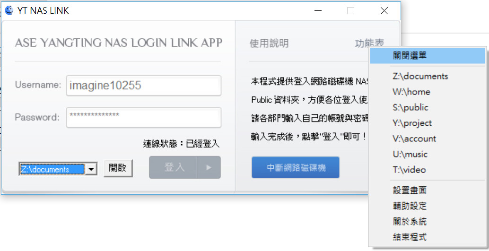

# NASConnection
NAS連線工具

由於公司使用的 NAS 資料系統 ，許多同事在連線時，都常會有設定連線失敗後 被判斷為多次帳號密碼輸入失敗而遭 IP 鎖定 無法連線，為了解決這個問題，使用 Visual Basic 6 開發了一套 NAS 連線程式，而又因為太多 部門連線到的權限資料夾不同，把連線的 IP 位置 改為設定檔的方式，在 InI 檔案內做設定。 利用這個工具，即使失敗了也不會遭到誤判的 IP

 * 使用語言為 VB6
 * 遠端磁碟機連線，執行後會縮至右下角，結束時會自動中斷所有連線
 * 可定時提醒休息 (保護眼睛避免眼睛使用過久)
 
## Reference architecture:

```txt
NASConnection
├── bin
│   ├── NASConnection001.exe (執行檔)
│   └── NASConfig.ini (連線設定檔)
│
└── source_code
    └── ... 原始碼
```

## Review:



